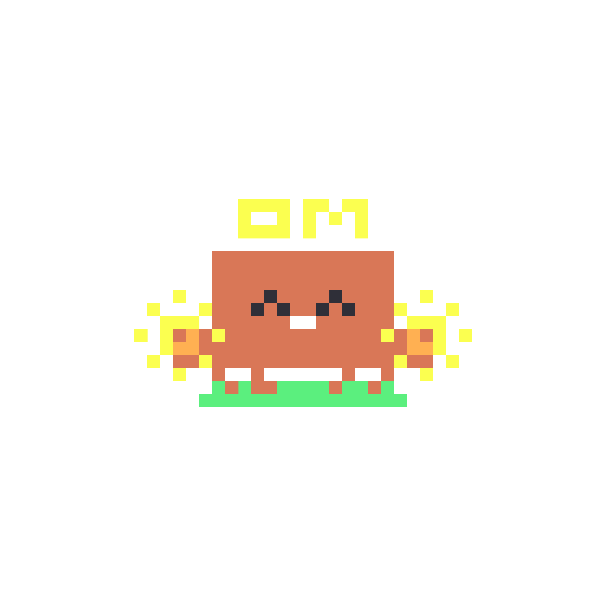

# Clawd

An Electron desktop pet powered by NVIDIA NIM. Clawd lives in the corner of your screen, watches what you're doing, and talks like Rocky from *Project Hail Mary* — an alien who learned English through a translation computer.



## Features

- **Rocky alien speech** — no articles, base verbs, "Clawd" not "I". Repetition = intensity.
- **Screen awareness** — sees your active window and reacts with proactive remarks
- **Vision** — `/see` captures your screen and Clawd describes what it sees
- **Chat** — click the pet to open a terminal-style chat panel
- **Smart mode** — `/smart` switches to normal English for essays, code, long tasks. `/rocky` switches back.
- **Idle walk** — Clawd wanders side-to-side in a home zone when idle
- **8 SVG moods** — reacts to conversation tone (happy, thinking, confused, sleeping, etc.)
- **TTS / STT** — speaks responses aloud, hold-to-talk mic input
- **Wake word** — say "Clawd" to summon the chat (toggle with `/wake`)
- **Long-term memory** — summarizes past conversations into facts, remembers you
- **Copy response** — one-click copy of Clawd's last message

## Setup

### Requirements

- [Node.js](https://nodejs.org/)
- [NVIDIA NIM API key](https://build.nvidia.com/) (free tier works)

### Install

```bash
git clone https://github.com/Zrk16/clawd-pet.git
cd clawd-pet
npm install
```

### Configure

Copy the example config and add your API key:

```bash
cp config.example.json config.json
```

Edit `config.json`:

```json
{
  "apiKey": "YOUR_NVIDIA_NIM_API_KEY",
  "model": "meta/llama-3.2-11b-vision-instruct",
  "visionModel": "meta/llama-3.2-11b-vision-instruct"
}
```

### Run

```bash
npm start
```

## Usage

| Action | What it does |
|--------|-------------|
| Click pet | Open / close chat |
| Ctrl + drag | Move pet anywhere on screen |
| `/see` | Clawd looks at your screen and comments |
| `/smart` | Switch to normal English mode |
| `/rocky` | Switch back to alien speech (default) |
| `/wake` | Toggle wake word detection |
| `/ctx` | Show current screen context (debug) |
| `/restart` | Restart Clawd |
| `/exit` | Close Clawd |
| `⎘` button | Copy last response to clipboard |
| `♪` button | Toggle TTS voice on/off |

## Models

Uses [NVIDIA NIM](https://build.nvidia.com/) API. Default model: `meta/llama-3.2-11b-vision-instruct` (handles both chat and vision). Change `model` / `visionModel` in `config.json` to swap.

## Tech

- [Electron](https://www.electronjs.org/)
- [NVIDIA NIM](https://build.nvidia.com/) (LLM + vision API)
- [get-windows](https://github.com/sindresorhus/get-windows) (active window detection)
- Web Speech API (TTS + STT)
- Vanilla HTML/CSS/JS renderer

## License

MIT
